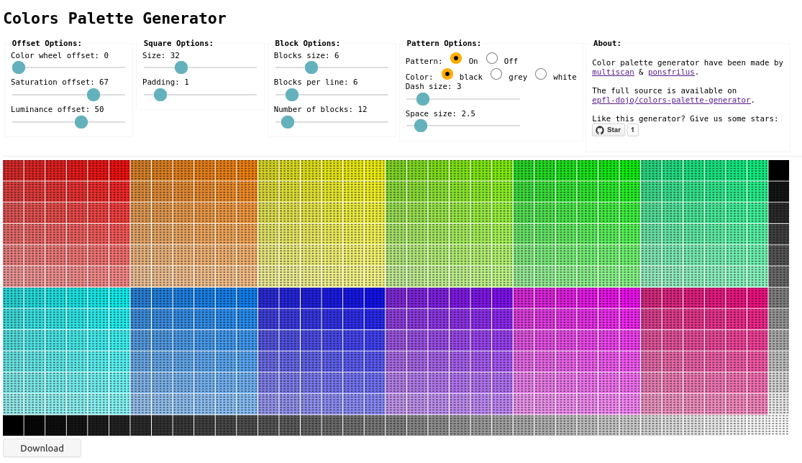

# colors palette generator

Try it on https://epfl-dojo.github.io/colors-palette-generator/.

## Links

  * https://en.wikipedia.org/wiki/Color_wheel & https://en.wikipedia.org/wiki/Color_theory
  * https://color.adobe.com
  * https://developer.mozilla.org/en-US/docs/Web/API/CanvasRenderingContext2D/fillStyle
  * https://stackoverflow.com/questions/26889358/generate-color-palette-from-image-with-imagemagick
  * https://superuser.com/questions/290656/combine-multiple-images-using-imagemagick
  * https://stackoverflow.com/questions/55954965/process-image-with-imagemagick-to-default-palette-for-example-16-or-256-colou
  * https://github.com/cyrilis/colors-palette
